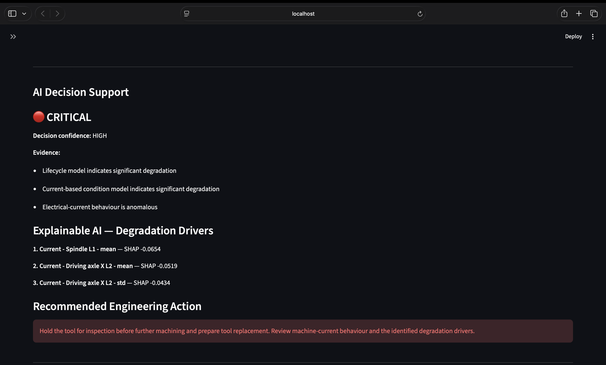
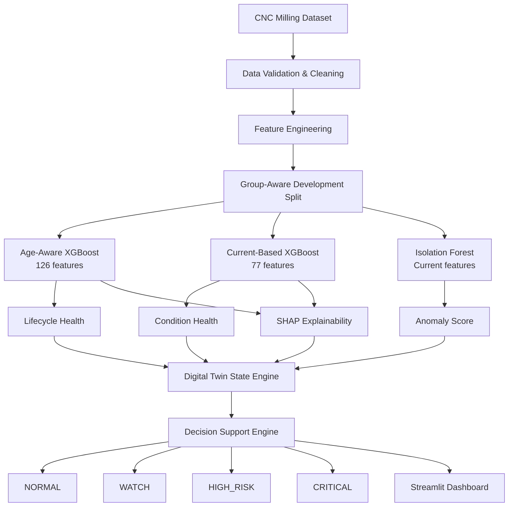
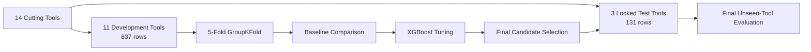
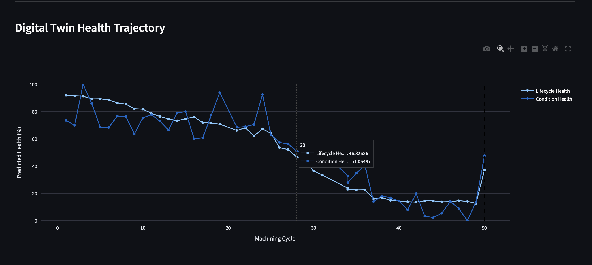
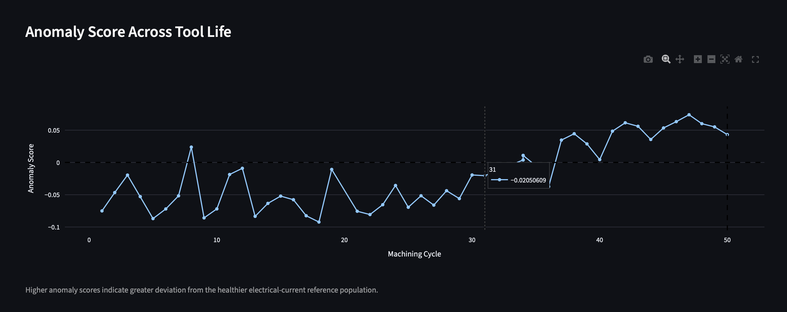

# AI-Driven CNC Manufacturing Digital Twin

<p align="center">
  <strong>Predictive Tool Health • Anomaly Detection • Explainable AI • Manufacturing Decision Support</strong>
</p>

<p align="center">
  
  
  
  
  
  
</p>

---

## Overview

This project implements an **AI-driven Digital Twin prototype for CNC milling tool health monitoring**. It combines supervised machine learning, unsupervised anomaly detection, explainable AI, and a transparent decision-support layer to estimate the current state of a cutting tool and convert model outputs into actionable manufacturing recommendations.

The system is designed around four questions:

1. **What is the estimated lifecycle health of the cutting tool?**
2. **What does the machine's electrical behaviour indicate about its physical condition?**
3. **Is the current behaviour abnormal relative to healthier operating conditions?**
4. **Why is the system making this prediction, and what action should an engineer take?**

The final application exposes these signals through an interactive **Streamlit Digital Twin dashboard**.

> **Project scope:** This is a research/portfolio Digital Twin prototype for manufacturing decision support. It is not a certified machine-control system, a production MES implementation, or a direct DELMIA/3DEXPERIENCE integration.

---

## Key Results

### Final unseen-tool evaluation

| Model | Features | Test MAE | Test RMSE | Test R² |
|---|---:|---:|---:|---:|
| **Current-based XGBoost** | 77 | 0.1373 | **0.1744** | **0.6563** |
| **Age-aware XGBoost** | 126 | **0.1317** | 0.1775 | 0.6437 |

### Additional Digital Twin findings

- **72.1% anomaly rate** in the experimental `CRITICAL` health band, compared with 11.1% in `HEALTHY`.
- **34 of 35** experimentally critical samples were escalated to `HIGH_RISK` or `CRITICAL` by the transparent decision-support rules (**97.1% retrospective severe-warning coverage**).
- The **77-feature current/context model** slightly outperformed the larger 125-feature condition model during group-aware development evaluation.
- All final model evaluation is performed on **completely unseen cutting tools**, not a random row-wise split.

---

## 🖥️ Digital Twin Dashboard Preview

The interactive Streamlit dashboard turns model outputs into an engineering-oriented Digital Twin state by combining lifecycle prediction, electrical-condition monitoring, anomaly detection, SHAP explainability, and transparent decision support.

<p align="center">
  
</p>

The example above shows a **CRITICAL** operating state where multiple independent warning signals agree:

- the lifecycle model indicates significant degradation;
- the current-based condition model indicates significant degradation;
- electrical-current behaviour is anomalous;
- SHAP identifies the sensor variables pushing predicted health downward;
- the decision engine recommends tool inspection and replacement preparation.

> The dashboard is a research/portfolio prototype. Decision thresholds are transparent experimental rules and are not manufacturer-certified operating limits.

---

## Why This Project Matters

Traditional predictive-maintenance demonstrations often stop at a single model prediction. This project extends the workflow into a small Digital Twin decision system:

- sensor and manufacturing-process data are converted into a virtual tool-health state;
- a lifecycle model estimates normalized remaining health;
- a condition model estimates health without explicit cycle age;
- an Isolation Forest detects abnormal electrical behaviour;
- SHAP explains the strongest degradation drivers;
- a rule-based state engine fuses the independent signals;
- a decision layer produces **NORMAL, WATCH, HIGH_RISK, or CRITICAL** states with an engineering recommendation;
- a dashboard visualizes the evolving state across the tool trajectory.

This makes the project relevant to **smart manufacturing, Industry 4.0, predictive maintenance, condition monitoring, and Digital Twin decision support**.

---

## System Architecture



### Digital Twin State

For every milling-cycle observation, the virtual state contains:

- lifecycle health estimate;
- current/context condition-health estimate;
- lifecycle and condition health bands;
- health-gap value and model-agreement state;
- anomaly score and anomaly flag;
- SHAP-based degradation drivers;
- final risk state;
- supporting evidence;
- recommended engineering action.

---

## Dataset

The project uses the open CNC milling dataset published by **Grzegorz Piecuch and Tomasz Żabiński** in *Scientific Data* (2025):

> **A new open dataset from a milling process – data for classification and estimation of tool life**  
> *Scientific Data*, 12, Article 650 (2025)  
> DOI: https://doi.org/10.1038/s41597-025-04923-y  
> Dataset: https://doi.org/10.6084/m9.figshare.28589216

The project uses the processed feature file:

```text
FeatureAndMetadata_Milling.csv
```

### Dataset characteristics

| Property | Value |
|---|---:|
| Milling cycles | 968 |
| Cutting tools | 14 |
| Total columns after header correction | 131 |
| Sensor-derived features | 120 |
| Vibration channels | 8 |
| Current channels | 12 |
| Measurement channels | 20 |
| Current-derived features | 72 |
| Vibration-derived features | 48 |
| Process-context features used | 5 |

The 120 sensor features are derived from six time-domain statistics per measurement channel:

```text
min • max • mean • standard deviation • skewness • kurtosis
```

### Target

```text
CycleToFailureNormalized
```

Interpretation:

```text
1.0  → beginning of tool life / healthier state
0.0  → end of life / failure
```

### Leakage prevention

`CycleToFailure` contains direct future-life information and is therefore **never used as a model feature**.

Identifiers such as `ToolIndex`, `SampleIndex`, and `FileName` are also excluded from the predictive feature matrix. `ToolIndex` is used only as the grouping variable for leakage-safe validation and as the Digital Twin entity identifier.

---

## Data Preparation

The source CSV required a dataset-specific correction: its true feature names were stored as the first data row while the imported columns appeared as `Column1 ... Column131`.

The pipeline therefore:

1. loads the original CSV without modifying the source file;
2. detects generic column names;
3. promotes the embedded first row to the actual header;
4. normalizes decimal formatting;
5. converts model inputs to numeric types;
6. renames the source typo `TollIndex` to `ToolIndex` internally;
7. validates dimensions, missing values, duplicates, and target range;
8. categorizes sensor, process-context, identifier, target, and leakage columns;
9. creates a group-aware train/test split using `ToolIndex`.

Final cleaned dataset:

```text
968 rows × 131 columns
0 missing values
0 duplicate rows
0 constant features
```

---

## Leakage-Safe Validation Strategy

A random row-wise split would allow cycles from the same physical cutting tool to appear in both training and testing data. That would overestimate generalization.

This project instead uses **tool-level grouping**.



### Development tools

```text
3, 4, 5, 6, 7, 8, 9, 10, 101, 103, 105
```

### Locked test tools

```text
2, 11, 102
```

No cutting tool appears in both sets.

> The locked test tools were not used for model selection. Once final test evaluation was performed, the test set was considered consumed and was not used for additional hyperparameter tuning.

---

## Feature Experiments

Four feature configurations were evaluated.

| Experiment | Description | Features | Cycle Age? |
|---|---|---:|---:|
| `A_condition_based` | All current + vibration + process context | 125 | No |
| `B_current_based` | Current + process context | 77 | No |
| `C_vibration_based` | Vibration + process context | 53 | No |
| `D_age_aware` | All sensors + process context + `NumberOfCycle` | 126 | Yes |

`NumberOfCycle` was intentionally isolated in a separate experiment because its per-tool correlation with normalized health is **-1.0** by construction of the lifecycle target.

This makes it possible to distinguish **condition-based information** from explicit **tool-age information**.

---

## Exploratory Findings

### Strongest sensor-health relationships

The strongest univariate correlations were dominated by X-axis drive-current statistics.

| Feature | Correlation with health |
|---|---:|
| Current - Driving axle X L2 - mean | -0.6918 |
| Current - Driving axle X L1 - mean | -0.6916 |
| Current - Driving axle X L3 - mean | -0.6903 |
| Current - Driving axle Y L3 - mean | -0.5422 |
| Current - Driving axle Y L2 - mean | -0.5385 |

Electrical-current variables showed stronger average univariate relationships than vibration variables.

| Sensor family | Mean absolute correlation | Maximum |
|---|---:|---:|
| Electrical current | 0.2126 | 0.6918 |
| Vibration | 0.1460 | 0.4493 |

Signal variability was also informative: standard-deviation features had the highest mean absolute correlation across statistical feature types.

### Feature redundancy

The training data contains **57 sensor-feature pairs with absolute correlation ≥ 0.98**, particularly between the three electrical phases. These features were retained for the baseline study so that regularized and tree-based models could be compared without prematurely pruning the sensing representation.

---

## Baseline Models

Three baseline model families were evaluated using 5-fold `GroupKFold` on the 11 development tools:

- `DummyRegressor` — naïve mean benchmark;
- Ridge Regression — regularized linear baseline;
- Random Forest — nonlinear ensemble baseline.

Random Forest clearly outperformed the naïve and linear baselines on unseen validation tools.

### Random Forest cross-validation

| Experiment | MAE | RMSE | R² |
|---|---:|---:|---:|
| Age-aware | **0.1533** | **0.1950** | **0.5500** |
| Condition-based | 0.1751 | 0.2206 | 0.4240 |
| Current-based | 0.1827 | 0.2246 | 0.4030 |
| Vibration-based | 0.1740 | 0.2297 | 0.3757 |

Ridge Regression generalized poorly across tools, reinforcing that the relationship between process signals and tool health is strongly nonlinear.

---

## XGBoost Results

XGBoost improved on Random Forest for every feature experiment.

| Rank | Experiment | Features | CV MAE | CV RMSE | CV R² |
|---:|---|---:|---:|---:|---:|
| 1 | `D_age_aware` | 126 | **0.1351** | **0.1786** | **0.6224** |
| 2 | `B_current_based` | 77 | 0.1689 | 0.2176 | 0.4397 |
| 3 | `A_condition_based` | 125 | 0.1708 | 0.2184 | 0.4357 |
| 4 | `C_vibration_based` | 53 | 0.1707 | 0.2235 | 0.4090 |

### Engineering takeaway

The **current-based model slightly outperformed the full condition-based model** while using 48 fewer features:

```text
Current-based XGBoost RMSE   = 0.2176
Full condition XGBoost RMSE  = 0.2184
```

This suggests that, for this dataset, electrical-current measurements carry most of the condition-monitoring information required for cross-tool health estimation. This conclusion is dataset-specific and should not be interpreted as evidence that vibration sensing is generally unnecessary in machining systems.

---

## Final Locked-Test Evaluation

Two candidates were selected **before** opening the locked test set:

1. **Age-aware XGBoost** — best overall development performance;
2. **Current-based XGBoost** — best reduced condition-monitoring model without explicit cycle age.

### Final unseen-tool performance

| Model | Features | Test MAE | Test RMSE | Test R² |
|---|---:|---:|---:|---:|
| Age-aware XGBoost | 126 | **0.1317** | 0.1775 | 0.6437 |
| Current-based XGBoost | 77 | 0.1373 | **0.1744** | **0.6563** |

The condition model achieved slightly better aggregate RMSE and R² despite using fewer features and no explicit cycle-age input.

### Per-tool test performance

| Model | Tool | Samples | MAE | RMSE | R² |
|---|---:|---:|---:|---:|---:|
| Age-aware | 2 | 48 | 0.0595 | 0.0831 | 0.9232 |
| Age-aware | 11 | 1 | 0.7204 | 0.7204 | N/A |
| Age-aware | 102 | 82 | 0.1668 | 0.2000 | 0.5336 |
| Current-based | 2 | 48 | 0.1157 | 0.1489 | 0.7531 |
| Current-based | 11 | 1 | 0.7268 | 0.7268 | N/A |
| Current-based | 102 | 82 | 0.1427 | 0.1708 | 0.6599 |

> Tool 11 contains only one observation, so its tool-level R² is undefined. It is retained in the aggregate evaluation but interpreted separately rather than removed after observing the test result.

---

## Anomaly Detection

A separate **Isolation Forest** is trained on electrical-current features from healthier development samples:

```text
CycleToFailureNormalized >= 0.70
```

The detector answers a different question from the supervised models:

> **Does the current electrical behaviour look unusual relative to the healthier operating reference?**

Higher reported anomaly scores correspond to more abnormal behaviour.

### Anomaly rate by tool-health state

| Health state | Samples | Anomaly rate | Mean anomaly score |
|---|---:|---:|---:|
| HEALTHY | 244 | **11.1%** | -0.0498 |
| EARLY_WEAR | 241 | **14.5%** | -0.0435 |
| DEGRADED | 239 | **35.1%** | -0.0151 |
| CRITICAL | 244 | **72.1%** | 0.0315 |

The monotonic rise in anomaly rate provides an independent condition-monitoring signal that agrees with increasing tool degradation.

> The Isolation Forest is not treated as a failure classifier. It measures deviation from a healthier reference population.

---

## Explainable AI with SHAP

SHAP is used to explain both supervised XGBoost models globally and locally.

### Age-aware model: feature-family contribution

| Feature family | Importance share |
|---|---:|
| Vibration | **42.8%** |
| Cycle age | **29.0%** |
| Electrical current | **25.4%** |
| Process context | 2.8% |

`NumberOfCycle` is the **single most important feature**, but the model is not purely age-driven. Physical sensor features collectively contribute most of the total SHAP importance.

### Current-based model: feature-family contribution

| Feature family | Importance share |
|---|---:|
| Electrical current | **74.4%** |
| Process context | **25.6%** |

Important global drivers include:

- radial depth of cut (`RDOC`);
- material hardness (`HardnessMean`);
- X-axis drive-current mean values;
- X-axis current kurtosis and variability;
- spindle-current statistics.

The SHAP layer is also used inside the Digital Twin to surface the strongest features pushing predicted health downward for an individual tool state.

---

## Digital Twin State Engine

The Digital Twin combines four information sources:

```text
Lifecycle Health
      +
Condition Health
      +
Anomaly Score
      +
SHAP Degradation Drivers
      ↓
Digital Twin State
```

### Health gap

A useful state variable is:

```text
HealthGap = ConditionHealth - LifecycleHealth
```

Interpretation:

- **negative gap:** observed condition is worse than lifecycle expectation;
- **positive gap:** observed condition appears healthier than lifecycle expectation;
- **small gap:** both models broadly agree.

A prototype threshold of `±0.15` is used to flag substantial disagreement.

### Test-state summary

| Digital Twin signal | Result |
|---|---:|
| Mean absolute lifecycle/condition health gap | 0.0857 |
| Consistent states | 112 / 131 |
| Condition worse than lifecycle | 15 / 131 |
| Condition better than lifecycle | 4 / 131 |
| Anomalous states | 29 / 131 |

---

## Decision-Support Engine

A transparent rule-based decision layer converts the Digital Twin state into four operational categories:

```text
NORMAL → WATCH → HIGH_RISK → CRITICAL
```

The engine uses only model-derived information:

- lifecycle health;
- condition health;
- anomaly flag;
- lifecycle/condition disagreement;
- SHAP root-cause drivers.

`ActualHealth` is **never used by the decision logic**. It is retained only for retrospective evaluation.

### Decision distribution on the experimental test trajectories

| State | Samples |
|---|---:|
| NORMAL | 19 |
| WATCH | 46 |
| HIGH_RISK | 44 |
| CRITICAL | 22 |

### Retrospective severe-warning coverage

Of the 35 observations whose experimental ground truth was in the `CRITICAL` health band:

```text
17 → CRITICAL decision
17 → HIGH_RISK decision
 1 → WATCH decision
 0 → NORMAL decision
```

Therefore:

```text
34 / 35 = 97.1%
```

were escalated to `HIGH_RISK` or `CRITICAL`.

> This **97.1% value is retrospective decision-rule validation**, not an independently trained classifier metric and not a certified safety-performance claim.

### Example Digital Twin decision

```text
Machine: CNC-01
Tool: 2
Cycle: 50

Lifecycle Health : 37.2%
Condition Health : 47.7%
Anomaly          : TRUE
Anomaly Score    : 0.0431

Decision         : CRITICAL
Evidence Count   : 3
Confidence       : HIGH

Primary Drivers
1. Current - Spindle L1 - mean
2. Current - Driving axle X L2 - mean
3. Current - Driving axle X L2 - std

Recommended Action
Hold the tool for inspection before further machining and prepare
replacement. Review machine-current behaviour and the identified
degradation drivers.
```

Decision confidence describes **agreement among independent warning signals**; it is not a calibrated probability of failure.

---

## Streamlit Dashboard

The dashboard turns the analytical pipeline into an interactive Digital Twin application.

### Tool Health Trajectory

The Digital Twin tracks two complementary health estimates across the machining lifecycle:

- **Lifecycle Health** — age-aware XGBoost using sensor data, machining context, and `NumberOfCycle`;
- **Condition Health** — current/context XGBoost without explicit cycle age.

<p align="center">
  
</p>

This view allows an engineer to inspect how the two virtual health estimates evolve over time and where their trajectories agree or diverge.

### Anomaly Monitoring

The Isolation Forest provides a separate unsupervised signal indicating how far the current electrical behaviour deviates from the healthier reference population.

<p align="center">
  
</p>

Higher anomaly scores indicate greater deviation from healthier electrical-current behaviour. In the experimental data, anomaly frequency increases strongly as the tool moves toward the critical health region.

### 1. Twin Explorer

- choose a cutting tool and machining cycle;
- view lifecycle and condition health;
- inspect the health gap;
- see anomaly status and anomaly score;
- view decision state and evidence;
- inspect SHAP root-cause drivers;
- receive a recommended engineering action;
- explore health and anomaly trajectories across the tool life.

### 2. System Overview

- decision-state distribution;
- lifecycle/condition-health distributions;
- anomaly statistics;
- tool-level state summaries.

### 3. Model Validation

- locked-test metrics;
- predicted vs actual health trajectories;
- per-tool test performance;
- retrospective decision-state validation.

The validation page is intentionally separate from the operational Twin Explorer because **ground-truth remaining health would not normally be available continuously in a real manufacturing deployment**.

---

## Technology Stack

| Area | Tools |
|---|---|
| Language | Python |
| Data processing | pandas, NumPy |
| Machine learning | scikit-learn, XGBoost |
| Anomaly detection | Isolation Forest |
| Explainability | SHAP |
| Visualization | Matplotlib, Plotly |
| Dashboard | Streamlit |
| Model persistence | joblib |
| Testing | pytest |
| Version control | Git / GitHub |

---

## Repository Structure

```text
ai-manufacturing-digital-twin/
│
├── dashboard/
│   └── app.py
│
├── docs/
│   └── images/
│       ├── dashboard-critical-decision.png
│       ├── dashboard-health-trajectory.png
│       └── dashboard-anomaly-trajectory.png
│
├── data/
│   ├── raw/                    # Source file (gitignored)
│   └── processed/
│       ├── milling_clean.csv
│       ├── train.csv
│       └── test.csv
│
├── models/
│   ├── B_current_based_xgboost.joblib
│   ├── D_age_aware_xgboost.joblib
│   └── isolation_forest_current.joblib
│
├── reports/
│   ├── figures/
│   ├── phase4_...              # EDA outputs
│   ├── phase5_...              # Feature manifests/audits
│   ├── phase6_...              # Baseline results
│   ├── phase7_...              # XGBoost tuning/results
│   ├── phase8_...              # Locked-test results
│   ├── phase9_...              # Anomaly detection
│   ├── phase10_...             # SHAP outputs
│   ├── phase11_...             # Digital Twin states
│   └── phase12_...             # Decision-support outputs
│
├── src/
│   ├── __init__.py
│   ├── inspect_dataset.py
│   ├── data_pipeline.py
│   ├── eda.py
│   ├── features.py
│   ├── maintenance_model.py
│   ├── xgboost_model.py
│   ├── final_evaluation.py
│   ├── anomaly_detection.py
│   ├── explainability.py
│   ├── digital_twin.py
│   └── decision_engine.py
│
├── tests/
│   ├── test_data_pipeline.py
│   ├── test_decision_engine.py
│   └── test_models.py
│
├── pytest.ini
├── requirements.txt
├── README.md
└── .gitignore
```

---

## Installation

### 1. Clone the repository

```bash
git clone <YOUR_REPOSITORY_URL>  # replace with your GitHub repository URL
cd ai-manufacturing-digital-twin
```

### 2. Create and activate a virtual environment

Python 3.11+ is recommended.

```bash
python3 -m venv manufacturing-venv
source manufacturing-venv/bin/activate
```

Windows PowerShell:

```powershell
python -m venv manufacturing-venv
manufacturing-venv\Scripts\Activate.ps1
```

### 3. Install dependencies

```bash
python -m pip install --upgrade pip
python -m pip install -r requirements.txt
```

---

## Dataset Setup

The source dataset is intentionally not committed to `data/raw/`.

Download `FeatureAndMetadata_Milling.csv` from the official Figshare dataset:

https://doi.org/10.6084/m9.figshare.28589216

Place it at:

```text
data/raw/FeatureAndMetadata_Milling.csv
```

Do not manually modify the file; the data pipeline handles the embedded-header correction programmatically.

---

## Running the Full Pipeline

Run the scripts from the repository root.

```bash
# 1. Inspect source dataset
python src/inspect_dataset.py

# 2. Clean, validate and create group-aware split
python src/data_pipeline.py

# 3. Exploratory data analysis
python src/eda.py

# 4. Create feature experiments and audits
python src/features.py

# 5. Train baseline models
python src/maintenance_model.py

# 6. Tune/evaluate XGBoost using GroupKFold
python src/xgboost_model.py

# 7. Evaluate selected models on locked unseen tools
python src/final_evaluation.py

# 8. Train and evaluate anomaly detector
python src/anomaly_detection.py

# 9. Generate SHAP explanations
python src/explainability.py

# 10. Build Digital Twin states
python src/digital_twin.py

# 11. Generate decision-support states
python src/decision_engine.py
```

### Launch the dashboard

```bash
streamlit run dashboard/app.py
```

Then open the local URL printed by Streamlit, typically:

```text
http://localhost:8501
```

---

## Automated Tests

The project includes tests for:

- cleaned dataset integrity;
- train/test tool isolation;
- target-range validation;
- persisted model artifacts;
- feature counts;
- decision-engine behaviour;
- multi-signal CRITICAL escalation logic.

Run:

```bash
python -m pytest -v
```

Current project status:

```text
17 tests passed
```

Using `python -m pytest` is recommended so that pytest runs through the same Python interpreter as the active project environment.

---

## Key Engineering Conclusions

1. **Tool-level validation matters.** Random row splits are inappropriate when repeated cycles from the same physical tool are present.
2. **Electrical current is highly informative.** A 77-feature current/context model matched or exceeded the larger condition model on unseen tools.
3. **Age helps, but it is not the full explanation.** The age-aware model benefits strongly from `NumberOfCycle`, while SHAP still shows substantial physical-sensor contribution.
4. **Nonlinear models are required.** Random Forest and XGBoost generalized much better than Ridge Regression across unseen tools.
5. **Anomaly detection adds complementary information.** Abnormal-current rates rise substantially as tool health approaches the critical region.
6. **Model fusion is more useful than a single prediction.** Lifecycle health, condition health, anomalies, and SHAP explanations provide a richer operational state.
7. **Transparent decision logic is valuable.** The recommendation layer remains explainable and auditable rather than hiding a second black-box classifier behind the predictive models.

---

## Limitations

This project is intentionally presented as a prototype, and several limitations should be considered when interpreting the results.

- The dataset contains only **14 cutting tools**, so cross-tool generalization is evaluated on a relatively small population.
- The locked test set contains unequal trajectory lengths; Tool 11 has only one observation.
- Overall test metrics are therefore sample-weighted and are influenced strongly by Tool 102, which contributes 82 of 131 test rows.
- Hyperparameter tuning and development CV use the same GroupKFold framework. A larger research study should consider nested group-aware cross-validation.
- The `HEALTHY`, `EARLY_WEAR`, `DEGRADED`, and `CRITICAL` thresholds are prototype state definitions rather than manufacturer-certified wear limits.
- Decision rules were designed as transparent engineering logic and retrospectively compared with the experimental target; they are not independently learned or certified safety rules.
- Isolation Forest anomaly labels depend on the chosen healthier-reference definition and contamination setting.
- The dashboard operates on experimental dataset trajectories rather than a live CNC communication protocol.
- No uncertainty-calibration layer is currently provided for the supervised health estimates.

---

## Future Work

Possible extensions include:

- ingesting live CNC telemetry using **MTConnect, OPC UA, or an industrial message broker**;
- validating on more machines, tools, materials, and machining conditions;
- nested GroupKFold for stronger hyperparameter-selection estimates;
- predictive uncertainty and calibrated confidence intervals;
- time-series models using the raw high-frequency signals;
- correlation-aware feature reduction and sensor-cost optimization;
- online drift detection and model-health monitoring;
- maintenance-history integration;
- model registry and reproducible deployment pipeline;
- connection to a manufacturing execution or Digital Manufacturing platform.

---

## Reproducibility Notes

- All feature-selection and scaling/preprocessing decisions are performed using development data only.
- The locked test tools are not used during model selection.
- `CycleToFailure` is excluded to prevent future-information leakage.
- `ActualHealth` is used only for experimental evaluation, never for real-time decision generation.
- Raw predictions are used for formal model metrics; clipping to `[0, 1]` is used only when presenting normalized health in the Digital Twin UI.
- Random seeds are fixed where supported by the modeling libraries.

---

## References

1. Piecuch, G., & Żabiński, T. (2025). **A new open dataset from a milling process – data for classification and estimation of tool life.** *Scientific Data*, 12, 650. https://doi.org/10.1038/s41597-025-04923-y
2. Dataset repository: **Figshare** — https://doi.org/10.6084/m9.figshare.28589216
3. Grieves, M. (2014). **Digital Twin: Manufacturing Excellence through Virtual Factory Replication.** Conceptual inspiration for the physical/virtual/data connection used in this prototype.

---

## Project Status

```text
Data ingestion & validation       ✅
Leakage-safe tool split           ✅
Exploratory data analysis         ✅
Feature experiments               ✅
Baseline ML                       ✅
XGBoost modeling                  ✅
Locked unseen-tool evaluation     ✅
Anomaly detection                 ✅
SHAP explainability               ✅
Digital Twin state engine         ✅
Decision-support engine           ✅
Streamlit dashboard               ✅
Automated testing                 ✅ 17 passed
```

---

<p align="center">
  <strong>Built as an end-to-end smart-manufacturing portfolio project demonstrating the transition from sensor data → machine learning → interpretable Digital Twin state → engineering decision support.</strong>
</p>
